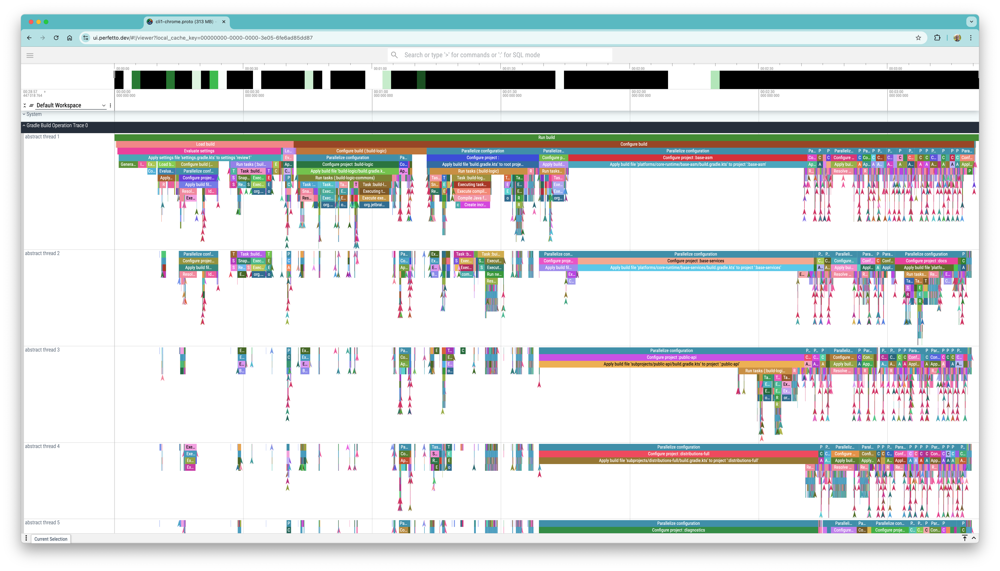

# Gradle Build Operation Trace Converter

Command-line tool for analysis and conversion of Build Operation traces of Gradle Build Tool into other formats:

* **Chrome trace** ([Perfetto](https://ui.perfetto.dev/) trace) in a Protobuf format
* **Timeline** - a CSV with tasks and transforms executions



## How to install

1. `git clone https://github.com/gradle/gradle-to-trace-converter`
2. `cd gradle-to-trace-converter`
3. `./gradlew install`: this will install a distribution to `gradle-to-trace-converter/distribution`
4. Add alias to a shell startup script (e.g. `.zshrc`, `.bashrc` etc.) to path of the distribution, or add the
   distribution path to `$PATH`

Example of an alias for macOS:

```sh
alias gtc="/Users/user/workspace/gradle-to-trace-converter/distribution/bin/gtc"
```

Note: You can also modify the distribution installation directory with `gtc.install.dir` Gradle property or System
property.

## Capturing a trace

In order to convert the trace to Perfetto format, you need to capture it.

### Command-line

For **command-line invocations** you can pass the `org.gradle.internal.operations.trace` system property:

```sh
cd /path/to/project

./gradlew -Dorg.gradle.internal.operations.trace.tree=false \
    -Dorg.gradle.internal.operations.trace.tree=false \
    -Dorg.gradle.internal.operations.trace=/path/to/project/trace

# Writes the trace to '/path/to/project/trace-log.txt'
```

The trace appears in the destination directory, using the last part of the path as the filename prefix,
and appending `-log.txt` at the end.

Setting `org.gradle.internal.operations.trace.tree` to `false` avoid producing extra files, which are not required for trace conversion.

### IDE Sync

For **sync builds** with IntelliJ IDEA or Android Studio, you need to provide the properties via `jvmargs`:

```properties
# gradle.properties

org.gradle.jvmargs= <your properties> \
    -Dorg.gradle.internal.operations.trace.tree=false \
    -Dorg.gradle.internal.operations.trace=/path/to/project/trace

# Writes the trace to '/path/to/project/trace-log.txt'
```

**Warn**: you have to specify absolute paths,
otherwise the files are resolved relative to the working directory of the daemon,
which for sync is not the project directory.

**Note**: any Gradle invocation by the IDE would override the trace file.
Make sure to change the prefix after each trace you capture to avoid this.

## Converting a trace

Now you can convert the trace to a Chrome trace:

```sh
gtc /path/to/project/trace-log.txt 

# Creates a Chrome trace: /path/to/project/trace-chrome.proto
```

The trace can be viewed in the [Perfetto UI](https://ui.perfetto.dev/).
You can drag-n-drop the file on that page.


## More options

It is also possible to filter the trace.
Include (`-i`) only the operations in the `Run tasks` **subtree**
and exclude (`-e`) any operations starting with `Download` word.

```sh
gtc /path/to/project/trace-log.txt -i "Run tasks" -e "Download.*"'
```

### Help

```
Usage: gradle-trace-converter [OPTIONS] trace

Options:
  -o, --output-format [all|chrome|timeline]
                                   The output format to use
  -i, --include VALUE              Regex to filter the build operations to
                                   include by display name
  -e, --exclude VALUE              Regex to filter the build operations to
                                   exclude
  -h, --help                       Show this message and exit

Arguments:
  trace  Path to the build operation trace file (ends with -log.txt)
```

## Requirements

Requires JVM 17 to build and run
